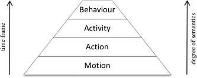
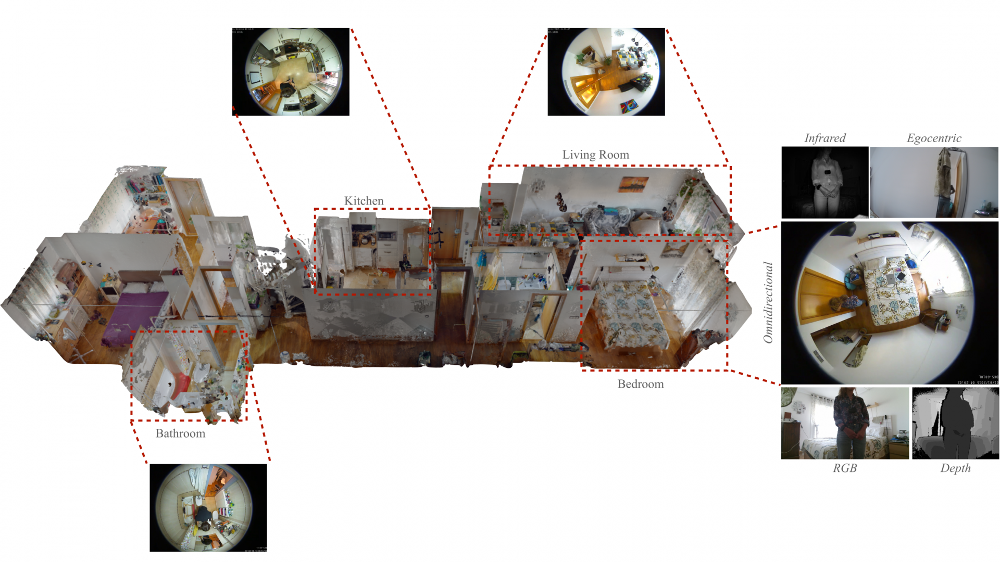

# Video-based human action/activity recognition

## Objectives

## Introduction

Human Action and Activity Recognition (HAR) stands as a vibrant and swiftly advancing field within computer vision, centred on the automatic detection and categorisation of human actions and behaviours from visual data. At its heart, HAR endeavours to interpret and comprehend the subtleties of human movements by analysing data captured through various means such as cameras, depth sensors, and increasingly, sophisticated AI-driven techniques. This domain blends elements from image processing, pattern recognition, machine learning, and artificial intelligence to forge systems capable of identifying specific activities—from straightforward gestures to complex interactions—within a given environment. The applications of HAR are extensive and diverse, spanning sectors such as surveillance, healthcare, sports analysis, human-computer interaction, and entertainment, making it a field of significant interest and continual innovation in both research and practical applications. As technology progresses, HAR continues to push the frontiers of how machines perceive and interact with human dynamics, offering profound implications for the future of automated systems and AI.

While the terms "action", "activity", and "behaviour" are often used interchangeably, it is important to distinguish between them for clarity.

A human action is typically characterised as a distinct, observable, and generally brief movement or sequence of movements. Examples of this include actions such as clapping, jumping, or waving. Within the realm of computer vision, the recognition of an action entails the identification of these movements from visual data, which is often captured in a succession of frames or video segments. The principal challenge in this context is to accurately interpret these movements, which can exhibit considerable variation in terms of speed, scale, and context.

Activities are inherently more complex, often consisting of multiple actions that amalgamate to form a coherent sequence. These are usually more extended in duration and might include interactions with objects or other individuals. Examples include activities like 'preparing a meal' or 'playing a game of football'. The process of recognising activities is more intricate, as it not only necessitates the identification of individual actions but also demands an understanding of the sequence and context in which these actions occur. This typically involves the interpretation of a series of actions and their interrelationships over a specific period.

Human behaviour encompasses a more comprehensive scope than individual actions or activities. It involves the interpretation of a sequence of actions in conjunction with their underlying intentions, emotional states, and interactions with the environment and others. Behaviour analysis in HAR extends beyond the mere recognition of physical movements, delving into the nuances of how and why these actions occur within specific contexts. This includes understanding social interactions, emotional responses, and the broader patterns that characterise human conduct, making it a crucial and complex aspect of study in HAR.



```
Mandatory readings: 
* [A review on vision techniques applied to Human Behaviour Analysis for Ambient-Assisted Living](https://doi.org/10.1016/j.eswa.2012.03.005) - Section 2. HBA taxonomies
* [Going Deeper into Action Recognition: A Survey ](https://doi.org/10.1016/j.imavis.2017.01.010) - Subsection But first, what is an action?
```
HAR is a subset in the field of Human Action Understanding. Related problems are action prediction, temporal action proposal/detection, spatiotemporal action proposal/detection, action instance segmentation, dense captioning...

Mandatory reading: 
* [Video Action Understanding: A Tutorial](https://apps.dtic.mil/sti/trecms/pdf/AD1143531.pdf) - Section 2. Problems

HAR is extensively applied across various domains, significantly influencing areas such as human-computer interaction, intelligent video surveillance, ambient assisted living, human-robot interaction, entertainment, and intelligent driving. Each application leverages the unique capabilities of HAR to interpret human movements and activities, thereby enhancing interaction and efficiency. For example, in human-computer interaction, HAR systems observe and respond to user actions, while in surveillance, they detect and report suspicious activities. In entertainment, particularly in interactive gaming, HAR enriches user experiences by recognising player movements. Similarly, in ambient assisted living, it aids in monitoring and ensuring the safety of individuals, especially older people or those with disabilities.

Optional readings:
* Chaaraoui, A. A., Climent-Pérez, P., & Flórez-Revuelta, F. (2012). A review on vision techniques applied to human behaviour analysis for ambient-assisted living. Expert Systems with Applications, 39(12), 10873-10888. (https://doi.org/10.1016/j.eswa.2012.03.005) 
* Climent-Pérez, P., Spinsante, S., Mihailidis, A., & Florez-Revuelta, F. (2020). A review on video-based active and assisted living technologies for automated lifelogging. Expert Systems with Applications, 139, 112847. (https://doi.org/10.1016/j.eswa.2019.112847)

## Video modalities

This section delves into the various video modalities—such as RGB, depth, thermal, omnidirectional, egocentric, and neuromorphic—each providing unique insights and challenges in capturing human actions. While there is some overlap, comprehending these modalities is crucial, as they lay the groundwork upon which recognition algorithms are built and refined.

* **RGB**: It stands for Red, Green, and Blue, the primary colours of light. RGB video captures visual information using these three colour channels, combining them in various ways to produce a broad spectrum of colours. RGB video is adept at capturing the fine details of a scene, including textures, colours, and nuances of human movements. Due to its widespread availability and ease of processing, RGB video is often the first choice in many action recognition systems, ranging from simple gesture recognition to complex activity analysis. One of the primary challenges with RGB video is its sensitivity to environmental factors like lighting conditions and background clutter, which can significantly impact the quality and reliability of the captured data.

* **Depth**: Depth sensing involves capturing the distance between the camera and the objects in its field of view. Unlike traditional RGB cameras which capture colour information, depth sensors measure how far away each part of the scene is from the camera. This can be achieved through various technologies, such as Time-of-Flight (ToF), structured light, or stereo vision, each with its unique mechanism for capturing depth information. Depth data provides crucial spatial information about the scene, enabling more accurate analysis of the position and movements of people within a three-dimensional space. Unlike RGB video, depth sensing is not as susceptible to changes in lighting conditions, making it particularly useful in poorly lit environments. Depth sensors can have limitations such as lower spatial resolution compared to RGB cameras and sensitivity to reflective surfaces or extreme distances. Often, the most effective systems use a combination of RGB and depth data to leverage the strengths of both modalities.

* **Thermal**: Thermal cameras, also known as infrared cameras, capture the infrared radiation (heat) emitted by objects and people. Unlike visible light, every object emits infrared radiation, providing a different perspective compared to traditional RGB or depth sensing. These cameras translate the infrared data into visible images, with warmer areas typically appearing brighter. The resulting thermal images reveal temperature variations in the scene, which can be used to detect and analyse human presence and movements. Thermal imaging is particularly effective in low-light or no-light conditions, making it valuable for night-time surveillance and monitoring. Typically, thermal cameras have lower spatial resolution compared to RGB cameras, which can limit the detail available for analysis. Moreover, The accuracy of thermal imaging can be affected by environmental factors like ambient temperature, humidity, and the presence of heat sources. 

* **Omnidirectional**: Unlike traditional cameras that capture a limited field of view, omnidirectional cameras are designed to record the entire environment around them. This is achieved either through a single wide-angle lens (like a fisheye lens) or by combining multiple cameras in a rig that covers all angles. One of the primary advantages of omnidirectional cameras in action recognition is their ability to eliminate blind spots, ensuring that no part of the scene is overlooked. In many applications, this comprehensive view is invaluable, as it allows for continuous monitoring of all activities without the need for multiple cameras. However, The wide-angle lenses often used in these cameras can introduce significant distortion, which needs to be corrected for accurate analysis of human actions. 

* **Egocentric (first-person) vision**: Egocentric vision, also known as first-person vision, is captured from the viewpoint of an individual, typically using a head-mounted or body-worn camera. This perspective closely mimics how a person sees the world, providing a personal and immersive viewpoint. Unlike other camera views that observe the subject from a distance, egocentric cameras are part of the subject's environment, capturing their daily activities, interactions, and the world as they experience it. This modality is particularly adept at capturing natural interactions and gestures, providing valuable insights into human behaviour, particularly in understanding how individuals interact with their environment and other people. However, they have several disadvantages: 
    1. Given the personal nature of the camera's placement, egocentric videos often contain significant motion blur and instability, posing challenges for stable and clear video analysis.
    2. While offering a unique perspective, egocentric cameras also have a limited field of view, focusing only on what the wearer is looking at, potentially missing out on surrounding activities.

* **Neuromorphic/event cameras**: Neuromorphic cameras are designed to mimic the human visual system. Unlike conventional cameras that capture frames at a fixed rate, neuromorphic cameras operate asynchronously, capturing changes in the scene as they occur. These cameras are event-driven, meaning they only capture and process parts of the scene where there is motion or change. This approach results in lower data rates and faster processing times, making them highly efficient. Neuromorphic cameras are particularly suited for high-speed action recognition tasks where traditional cameras may struggle, such as sports analytics or monitoring fast-moving machinery. Their ability to detect changes in challenging lighting conditions makes them valuable for applications in low-light environments and adverse weather conditions.

Mandatory readings: 
* [State of the Art of Audio- and Video-Based Solutions for AAL](https://doi.org/10.5281/zenodo.6390709) -  Section 1. Video-based sensing technologies
* [An Outlook into the Future of Egocentric Vision](https://doi.org/10.48550/arXiv.2308.07123)

Optional readings:
* Yu, J., Grassi, A. C. P., & Hirtz, G. (2023). Applications of Deep Learning for Top-View Omnidirectional Imaging: A Survey. In Proceedings of the IEEE/CVF Conference on Computer Vision and Pattern Recognition (pp. 6420-6432). (https://openaccess.thecvf.com/content/CVPR2023W/OmniCV/papers/Yu_Applications_of_Deep_Learning_for_Top-View_Omnidirectional_Imaging_A_Survey_CVPRW_2023_paper.pdf)
* Gallego, G., Delbrück, T., Orchard, G., Bartolozzi, C., Taba, B., Censi, A., ... & Scaramuzza, D. (2020). Event-based vision: A survey. IEEE transactions on pattern analysis and machine intelligence, 44(1), 154-180. (https://doi.org/10.1109/TPAMI.2020.3008413)

Optional viewings:
* Computer vision pills (1. Introduction, 2. Sensors and image modalities, 3. Camera setups), by Pau Climent-Pérez, at https://goodbrother.eu/onlinespeak


## Datasets
This section is dedicated to exploring and understanding the diverse range of datasets available for each of the video modalities we have discussed. These datasets are not just collections of data; they are the foundational blocks that fuel research and development in the field. By familiarising ourselves with these datasets, we will gain insights into the characteristics, challenges, and practical applications of the data they contain. Understanding the strengths and limitations of each dataset is crucial for effective application and research in the field. Some of them offer several of the video modalities previously discussed or, even, some non-video related data. For sake of clarity, they will be classified according to the main use by researcher.

* RGB:
    * Kinetics datasets (https://github.com/cvdfoundation/kinetics-dataset)
    * AVA (Atomic Visual Actions) dataset (https://research.google.com/ava)
    * Charades dataset (https://prior.allenai.org/projects/charades)
    * ActivityNet datasets (http://activity-net.org)
    * Toyota Smarthome dataset (https://project.inria.fr/toyotasmarthome)

* RGB-D:
    * NTU RGB+D datasets (https://rose1.ntu.edu.sg/dataset/actionRecognition)

* Egocentric:
    * Ego4D dataset (https://ego4d-data.org)
    * EPIC-Kitchen (https://epic-kitchens.github.io/2024)

More datasets are available at https://www.kaggle.com/datasets?search=human+action+recognition&tags=13207-Computer+Vision and https://paperswithcode.com/task/action-recognition-in-videos.

At the University of Alicante, we have published the OmniDirectional INdoor (ODIN) dataset, available at https://web.ua.es/en/ami4aha/odin-dataset.html. ODIN includes (1) RGB, infrared, and depth images from multiple RGB-D cameras, (2) egocentric videos, (3) physiological signals and accelerometer readings from a smart bracelet, and (4) 3D scans of the recording environments.



## HAR pre-deep learning
Understanding the pre-deep learning era is crucial for anyone involved in computer vision and human activity recognition. It not only provides historical context but also offers insights into the fundamental concepts and challenges that continue to influence current research and development in the field.

Early action recognition methods relied heavily on handcrafted features. These features, extracted from video frames, were designed to capture essential characteristics of human movements. Techniques such as Histogram of Oriented Gradients (HOG) and Scale-Invariant Feature Transform (SIFT) were commonly used. HOG was instrumental in capturing edge and gradient information, while SIFT provided robustness to scale and rotation changes in images.

Another cornerstone of traditional approaches was the analysis of time-series data derived from video sequences. Methods like Optical Flow, which captures motion by analysing the displacement of pixels between frames, played a significant role. Techniques such as Motion History Images (MHI) were developed to encapsulate movement information over time, providing a simplistic yet effective representation of actions.

Before deep learning, classical machine learning algorithms like Support Vector Machines (SVM), k-nearest neighbours (k-NN), and decision trees were widely used in conjunction with handcrafted features for action recognition tasks.

One of the most significant limitations of traditional methods was their reliance on handcrafted features. While effective in certain scenarios, these features often failed to capture the complexity and variability of human actions across different contexts and environments. As video resolutions and dataset sizes increased, the computational load of processing and analysing data using traditional methods became a significant challenge. The ability to process video data in real-time was often hindered by the computational intensity of traditional feature extraction and classification techniques. Moreover, accurately segmenting and recognizing actions within continuous video streams posed significant challenges, often leading to lower accuracy in complex real-world scenarios.

Mandatory reading: 
* [Going Deeper into Action Recognition: A Survey](https://doi.org/10.1016/j.imavis.2017.01.010) - Section 1. Where to start from? and Section 2. Local Representation based Approaches

## HAR post-deep learning
Deep learning has introduced a paradigm shift in how we approach the problem of action and activity recognition. With its ability to learn feature representations directly from data, deep learning models have overcome many of the limitations of traditional methods, offering enhanced accuracy, robustness, and adaptability.

The introduction of deep convolutional neural networks (CNNs), particularly with the success of models like AlexNet in image classification challenges, ignited interest in applying deep learning to HAR. The realization that deep learning could be extended beyond static images to video data, incorporating temporal dynamics, was a pivotal moment for the field.

CNNs are characterized by their deep, layered structure, typically comprising convolutional layers, pooling layers, and fully connected layers. Each layer performs a specific function: convolutional layers for feature extraction, pooling layers for dimensionality reduction, and fully connected layers for classification. As data passes through these layers, CNNs automatically learn hierarchical feature representations. Early layers capture basic visual features (like edges and textures), while deeper layers identify more complex patterns relevant to human actions. In the context of HAR, CNNs are initially applied to individual video frames, treating each frame as a static image. This approach allows the network to extract spatial features indicative of human actions within each frame. The features extracted from these frames serve as the building blocks for understanding actions. When combined with temporal analysis methods, they provide a comprehensive view of human activities.

Two-stream networks represent a pivotal innovation in using CNNs for HAR. These models consist of two separate CNNs: one stream processes individual frames for spatial information, and the other stream processes motion information (often using optical flow images). By combining these streams, two-stream networks effectively capture both the appearance and movement aspects of actions, leading to significantly improved recognition performance.

Mandatory reading: 
* [Two-Stream Convolutional Networks
for Action Recognition in Videos](http://papers.neurips.cc/paper/5353-two-stream-convolutional-networks-for-action-recognition-in-videos.pdf) - Section 2. Two-stream architecture for video recognition and Section 3. Optical flow ConvNets

While CNNs excel in spatial analysis, integrating temporal information remains a challenge. This limitation has led to the exploration of combining CNNs with models like RNNs and LSTMs for comprehensive spatio-temporal analysis. RNNs are designed to process sequential data, making them inherently suitable for video-based HAR, where actions unfold over time. They work by maintaining a 'memory' of previous inputs through internal states, allowing them to capture temporal dependencies. In HAR, RNNs analyse sequences of frames or features extracted from frames (using CNNs), providing a mechanism to understand actions as a progression of movements rather than isolated events. Standard RNNs are prone to the vanishing gradient problem, which hinders learning long-term dependencies. LSTMs address this by incorporating a gated mechanism, enabling them to retain information over longer sequences without degradation. This combination allows for a more holistic understanding of actions, capturing both the 'what' (spatial features) and the 'how' (temporal patterns) of human movements. For applications requiring real-time action recognition, the latency involved in processing sequences through RNNs and LSTMs can be a limiting factor. Research efforts are directed towards reducing this latency and improving the models' suitability for real-time applications.

Mandatory reading: 
* [Long-term recurrent convolutional networks for visual recognition and description](http://openaccess.thecvf.com/content_cvpr_2015/papers/Donahue_Long-Term_Recurrent_Convolutional_2015_CVPR_paper.pdf)

While traditional 2D CNNs excel in extracting spatial features from individual frames, 3D CNNs extend this capability to the temporal domain. They apply convolutions across both spatial dimensions (height and width of frames) and the temporal dimension (sequence of frames). This integrated approach allows 3D CNNs to learn spatio-temporal features directly from sequences of video frames, capturing both the appearance and motion information inherent in human actions. 3D CNNs enable end-to-end learning from raw video data, simplifying the action recognition pipeline by eliminating the need for separate feature extraction and temporal modelling steps. Due to their ability to process sequences of frames, 3D CNNs are particularly effective in recognising complex actions where the movement and appearance are closely intertwined. Various architectures of 3D CNNs have been proposed, each with different configurations and optimizations. Notable examples include C3D (3D ConvNet) and I3D (Inflated 3D ConvNet), which have demonstrated significant success in HAR tasks. One of the primary challenges with 3D CNNs is their high computational demand, as they process a larger volume of data compared to 2D CNNs. Optimising these models for efficiency without sacrificing performance is an active area of research.

Mandatory readings: 
* [Learning Spatiotemporal Features with 3D Convolutional Networks](https://openaccess.thecvf.com/content_iccv_2015/papers/Tran_Learning_Spatiotemporal_Features_ICCV_2015_paper.pdf)
* [Quo Vadis, Action Recognition? A New Model and the Kinetics Dataset](https://openaccess.thecvf.com/content_cvpr_2017/papers/Carreira_Quo_Vadis_Action_CVPR_2017_paper.pdf) - Section 2. Action Classification Architectures

Originally developed for natural language processing tasks, Transformers have been adapted to the field of HAR, bringing in their unique strengths and novel approaches. In HAR, Transformers are adapted to handle video data, where the attention mechanism can be applied to both spatial features within frames and temporal relations across frames. One of the key advantages of Transformers in HAR is their ability to capture long-range dependencies across video sequences. Unlike traditional models that may struggle with long temporal sequences, Transformers can effectively process and relate information from different parts of a video. This capability is particularly useful in understanding complex actions where context and the sequence of movements are crucial. Transformers do not require a fixed-size input, making them adaptable to various lengths of video sequences. This flexibility is beneficial in HAR where actions can vary significantly in duration. Transformers can be combined with other deep learning models, such as CNNs for spatial feature extraction, creating powerful hybrid architectures for action recognition. With ongoing optimizations, Transformers have the potential to be employed in real-time HAR systems, enhancing interactive applications like augmented reality and human-robot interaction.

Mandatory reading: 
* [Vivit: A video vision transformer](https://openaccess.thecvf.com/content/ICCV2021/html/Arnab_ViViT_A_Video_Vision_Transformer_ICCV_2021_paper.html)

Unlike traditional neural networks, Graph Neural Networks (GNNs) operate on graph structures, making them adept at handling data represented in nodes (vertices) and edges. In the context of HAR, this allows for the modelling of complex relationships and interactions within human actions. GNNs are particularly effective in scenarios where the spatial and temporal interactions between different body parts or objects are crucial for recognising an action. One of the common applications of GNNs in HAR is in analysing human poses represented as skeleton graphs. Each joint or key point on the human body is treated as a graph node, and the connections between them as edges. GNNs process these skeleton graphs to capture the dynamic relationships and dependencies between body parts, facilitating accurate recognition of actions based on pose and movement patterns. Some GNN-based HAR systems extend beyond spatial analysis by incorporating temporal information. This is achieved by constructing spatio-temporal graphs, where temporal connections are added between nodes across frames, enabling the network to understand actions as they evolve over time. Processing graph data can be computationally intensive, especially for large and complex graphs. Optimising GNN architectures for efficiency while maintaining their relational learning capabilities is a key challenge. The design of the graph structure, including how nodes and edges are defined and connected, significantly impacts the performance of GNNs. Research is ongoing to develop methods for optimal graph construction and learning in the context of HAR.

Mandatory readings: 
* [Spatial temporal graph convolutional networks for skeleton-based action recognition](https://ojs.aaai.org/index.php/AAAI/article/download/12328/12187)
* [Skeleton-Based Action Recognition with Shift Graph Convolutional Network](http://openaccess.thecvf.com/content_CVPR_2020/papers/Cheng_Skeleton-Based_Action_Recognition_With_Shift_Graph_Convolutional_Network_CVPR_2020_paper.pdf) - Section 2.1. GCN-based skeleton action recognition

Networks that combine one stream with RGB images and another with skeletons for action or activity recognition represent a significant advancement in the field. These dual-stream networks harness the strengths of both RGB data and skeletal information to provide a comprehensive analysis of human actions. The RGB stream effectively captures detailed visual information such as texture and colour, crucial for understanding the context and environment of the action. Simultaneously, the skeleton stream focuses on the movement and posture of the human body, offering robustness against background noise and variations in lighting or appearance. By integrating these two streams, such networks achieve a more nuanced and accurate understanding of actions, effectively interpreting both the physical movements and their surrounding contexts. This approach is particularly beneficial in complex scenarios where the background information is as crucial as the action itself, such as in interactive gaming, sports analysis, and advanced surveillance systems.

Optional readings:
* Wang, S., Zhou, L., Chen, Y., Huo, J., & Wang, J. (2022, July). When Skeleton Meets Appearance: Adaptive Appearance Information Enhancement for Skeleton Based Action Recognition. In 2022 IEEE International Conference on Multimedia and Expo (ICME) (pp. 1-6). IEEE. (https://ieeexplore.ieee.org/stamp/stamp.jsp?arnumber=9859589)
* Das, S., Dai, R., Yang, D., & Bremond, F. (2021). Vpn++: Rethinking video-pose embeddings for understanding activities of daily living. IEEE Transactions on Pattern Analysis and Machine Intelligence, 44(12), 9703-9717. (https://ieeexplore.ieee.org/stamp/stamp.jsp?arnumber=9613748) 

## Notebooks

* MHI
* optical flow
* MediaPipe pose estimation
* Step-by-step pose estimation model
* Example of I3D
* Example of transformer
* Example of GCN


