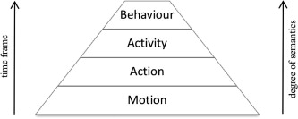
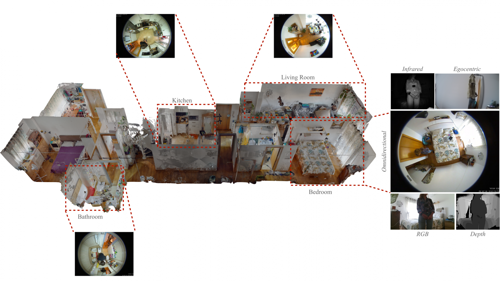

# Video-based human action/activity recognition

## Objectives

- Give you a clear overview of Human Action and Activity Recognition (HAR).
- Help you tell the difference between **action**, **activity**, and **behaviour**.
- Explain the main video modalities used in HAR (RGB, depth, thermal, omnidirectional, egocentric, and neuromorphic), and what each one is good for.
- Describe key approaches used before deep learning, including their main ideas and limits.
- Explain how deep learning changed HAR, and introduce the main model families used today: CNNs, RNNs/LSTMs, 3D CNNs, GNNs, and Transformers.

## Introduction

Human Action and Activity Recognition (HAR) is a fast-moving area of computer vision. It aims to detect and classify what people do in video and related sensor data. HAR draws on image processing, pattern recognition, machine learning, and AI. It supports many applications, such as video surveillance, healthcare monitoring, sports analysis, human–computer interaction, and entertainment.

HAR studies human motion at different time scales. You often see the terms **action**, **activity**, and **behaviour** used as if they mean the same thing. In this module, they mean different things.

**Action**  
An action is a short, observable movement, or a brief sequence of movements. Examples include *waving*, *clapping*, and *jumping*. In video, action recognition means identifying these movements from a sequence of frames. The main difficulty is that the same action can look different across people and situations (for example, changes in speed, viewpoint, scale, lighting, or background).

**Activity**  
An activity is longer and usually combines several actions into a meaningful sequence. Activities may also involve objects or other people. Examples include *preparing a meal* or *playing football*. Activity recognition is harder because the system must capture both **what** actions occur and **how** they are ordered and related over time.

**Behaviour**  
Behaviour is broader than a single action or activity. It describes patterns of actions over time in context. Behaviour analysis aims to interpret **what is happening and why**, which may involve intention, social interaction, and responses to the environment. This makes behaviour recognition more complex, because it depends strongly on context and can require higher-level reasoning beyond motion alone.

  

Mandatory readings: 
> * [A review on vision techniques applied to Human Behaviour Analysis for Ambient-Assisted Living](https://doi.org/10.1016/j.eswa.2012.03.005) - Section 2. HBA taxonomies
> * [Going Deeper into Action Recognition: A Survey ](https://doi.org/10.1016/j.imavis.2017.01.010) - Subsection But first, what is an action?
 

HAR is a subset of the broader field of **Human Action Understanding**, which aims to interpret human motion and interactions in video at different levels of detail. Within this wider area, several related problems appear alongside recognition:

- **Action prediction**: predict what action will happen next (or how an ongoing action will evolve) before it fully occurs.
- **Temporal action proposal / detection**: find *when* an action happens in an untrimmed video (start and end times), often without knowing the label in advance (proposal) or while also assigning the label (detection).
- **Spatiotemporal action proposal / detection**: find *when* and *where* an action happens by locating the relevant time segment and the actor region (for example, a bounding box track) across frames.
- **Action instance segmentation**: segment the actor (and sometimes relevant objects) at the pixel level for each action instance over time, not just with boxes.
- **Dense video captioning**: generate natural-language descriptions for multiple events in a video, often with temporal boundaries for each caption.

These tasks move beyond “what action is this?” and instead ask richer questions about **when**, **where**, **how**, and **what happens next** in a video.

> Mandatory reading: 
> * [Video Action Understanding: A Tutorial](https://apps.dtic.mil/sti/trecms/pdf/AD1143531.pdf) - Section 2. Problems

HAR is used in many domains and supports systems that must interpret what people do from video or related sensors. This can improve safety, interaction, and automation in real settings. Common application areas include:

- **Human–computer interaction (HCI)**: systems recognise user actions (for example, gestures or body movements) and respond in a natural way, enabling touch-free or context-aware interaction.
- **Intelligent video surveillance**: systems detect, classify, and sometimes localise events of interest, such as unusual or risky activities, and can raise alerts for human review.
- **Ambient Assisted Living (AAL)**: systems monitor daily activities to support safety and independence, for example by detecting falls, long periods of inactivity, or deviations from usual routines for **older people** or **people with disabilities**.
- **Human–robot interaction (HRI)**: robots use HAR to interpret human actions and intentions, which supports safer collaboration, better timing, and more appropriate assistance.
- **Entertainment and interactive gaming**: games adapt to player movements in real time, improving immersion and enabling controller-free interaction.
- **Intelligent driving**: systems monitor driver and passenger behaviour (for example, distraction, drowsiness, or unsafe movements) to support driver assistance and vehicle safety features.

Across these examples, HAR turns observed motion into actionable information that a system can use to make decisions or trigger responses.

> Optional readings:
> * Chaaraoui, A. A., Climent-Pérez, P., & Flórez-Revuelta, F. (2012). [A review on vision techniques applied to human behaviour analysis for ambient-assisted living](https://doi.org/10.1016/j.eswa.2012.03.005). Expert Systems with Applications, 39(12), 10873-10888.  
> * Climent-Pérez, P., Spinsante, S., Mihailidis, A., & Florez-Revuelta, F. (2020). [A review on video-based active and assisted living technologies for automated lifelogging](https://doi.org/10.1016/j.eswa.2019.112847). Expert Systems with Applications, 139, 112847. 

## Video modalities

This section introduces the main video modalities used in HAR: **RGB, depth, thermal, omnidirectional, egocentric, and neuromorphic/event**. Each modality captures different information about people and scenes. Understanding these differences matters because the modality shapes what an algorithm can learn, where it fails, and which applications it suits best.

- **RGB**
  - RGB stands for *Red, Green, Blue*. It captures colour and appearance in three channels.
  - **Strengths**: high spatial detail (texture, colour, fine motion cues), widely available, and supported by many standard models and datasets.
  - **Main challenges**: sensitive to lighting, shadows, background clutter, and viewpoint changes. Privacy concerns can also be higher because identity is often visible.

- **Depth**
  - Depth sensors measure the distance from the camera to surfaces in the scene, producing a 3D description of geometry.
  - **How it is captured**: common technologies include Time-of-Flight (ToF), structured light, and stereo vision.
  - **Strengths**: gives explicit shape and pose cues; more robust to lighting changes than RGB.
  - **Main challenges**: often lower resolution than RGB; can fail on reflective/transparent surfaces, in bright sunlight (for some sensors), or at extreme ranges. Many systems fuse **RGB + depth** to combine appearance with geometry.

- **Thermal (infrared)**
  - Thermal cameras measure infrared radiation (heat) emitted by objects and people, producing images based on temperature differences.
  - **Strengths**: works in low-light or no-light conditions; can highlight human presence even when RGB fails.
  - **Main challenges**: typically lower spatial detail; performance can vary with ambient temperature, humidity, heat sources, and sensor quality. Thermal data may also reduce some identity cues but does not remove privacy issues.

- **Omnidirectional (360°)**
  - Omnidirectional cameras capture a very wide field of view, often close to the full surrounding scene.
  - **How it is captured**: a single fisheye lens or multi-camera rigs stitched into a 360° view.
  - **Strengths**: fewer blind spots; useful when you want broad coverage without many cameras.
  - **Main challenges**: strong lens distortion and stitching artefacts; people may appear small and warped, which can hurt recognition unless you correct or model the distortion.

- **Egocentric (first-person) vision**
  - Egocentric video is recorded from the wearer’s viewpoint using head-mounted or body-worn cameras.
  - **Strengths**: captures hands, objects, and interactions in a natural way; useful for understanding daily activities and object manipulation.
  - **Main challenges**:
    1. Strong camera motion, motion blur, and rapid viewpoint changes.
    2. Limited field of view (only what the wearer looks at), so important context may be off-camera.

- **Neuromorphic / event cameras**
  - Event cameras do not record full frames at a fixed rate. Instead, each pixel reports **changes** in brightness asynchronously.
  - **Strengths**: very high temporal resolution, low latency, low data rates, and good performance in difficult lighting (for example, high dynamic range scenes). Useful for fast actions.
  - **Main challenges**: the output is not a standard video stream, so you need specialised representations and models (for example, event volumes, time surfaces, or spiking-inspired pipelines). Datasets and tooling are also less mature than for RGB.

> Mandatory readings: 
> * [State of the Art of Audio- and Video-Based Solutions for AAL](https://doi.org/10.5281/zenodo.6390709) -  Section 1. Video-based sensing technologies
> * [An Outlook into the Future of Egocentric Vision](https://doi.org/10.48550/arXiv.2308.07123)

> Optional readings:
> * Yu, J., Grassi, A. C. P., & Hirtz, G. (2023). [Applications of Deep Learning for Top-View Omnidirectional Imaging: A Survey](https://openaccess.thecvf.com/content/CVPR2023W/OmniCV/papers/Yu_Applications_of_Deep_Learning_for_Top-View_Omnidirectional_Imaging_A_Survey_CVPRW_2023_paper.pdf). In Proceedings of the IEEE/CVF Conference on Computer Vision and Pattern Recognition (pp. 6420-6432). 
> * Gallego, G., Delbrück, T., Orchard, G., Bartolozzi, C., Taba, B., Censi, A., ... & Scaramuzza, D. (2020). [Event-based vision: A survey](https://doi.org/10.1109/TPAMI.2020.3008413). IEEE transactions on pattern analysis and machine intelligence, 44(1), 154-180. 

> Optional viewings:
> * Computer vision pills (1. Introduction, 2. Sensors and image modalities, 3. Camera setups), by Pau Climent-Pérez, at [https://goodbrother.eu/onlinespeak](https://goodbrother.eu/onlinespeak)

## Datasets

This section introduces key datasets used in HAR across the video modalities discussed above. Datasets are more than collections of clips: they shape what problems researchers can study, which methods become popular, and how results are compared. By getting familiar with widely used datasets, you will better understand what data looks like in practice, which labels are available, and which limitations affect training and evaluation.

Some datasets include more than one modality (for example, RGB + depth) or add non-video signals (for example, audio, IMU, or metadata). For clarity, the list below groups datasets by their **main use** in the literature.

- **RGB**
  - [Kinetics datasets](https://github.com/cvdfoundation/kinetics-dataset)
  - [AVA (Atomic Visual Actions) dataset](https://research.google.com/ava)
  - [Charades dataset](https://prior.allenai.org/projects/charades)
  - [ActivityNet datasets](http://activity-net.org)
  - [Toyota Smarthome dataset](https://project.inria.fr/toyotasmarthome)

- **RGB-D**
  - [NTU RGB+D datasets](https://rose1.ntu.edu.sg/dataset/actionRecognition)

- **Egocentric**
  - [Ego4D dataset](https://ego4d-data.org)
  - [EPIC-Kitchen](https://epic-kitchens.github.io/2024)

More datasets are available at [https://www.kaggle.com/datasets?search=human+action+recognition&tags=13207-Computer+Vision](https://www.kaggle.com/datasets?search=human+action+recognition&tags=13207-Computer+Vision).

At the University of Alicante, we published the [OmniDirectional INdoor (ODIN) dataset](https://web.ua.es/en/ami4aha/odin-dataset.html). ODIN is a **multimodal** dataset that combines several sensing sources:

1. **Multi-camera RGB-D** recordings, including **RGB**, **infrared**, and **depth** images.
2. **Egocentric videos** recorded from the participant’s point of view.
3. **Wearable signals**, including **physiological measurements** and **accelerometer** readings from a smart bracelet.
4. **3D scans** of the recording environments, which support spatial and contextual analysis.

  

## HAR pre-deep learning

Understanding the pre-deep learning era is important because it explains many ideas that still appear in modern HAR pipelines (for example, explicit motion cues, temporal aggregation, and feature + classifier design). It also clarifies the limits that motivated deep learning.

Early action recognition methods relied on **handcrafted features** designed by experts. These features aimed to capture useful visual patterns from video frames. Common examples include:

- **Histogram of Oriented Gradients (HOG)**, which represents local edge and gradient structure.
- **Scale-Invariant Feature Transform (SIFT)**, which detects and describes keypoints in a way that is robust to changes in scale and rotation.

Traditional HAR also used **explicit motion representations** extracted from frame sequences:

- **Optical flow**, which estimates pixel motion between consecutive frames and provides a direct description of movement.
- **Motion History Images (MHI)**, which compress motion over time into a single image-like representation that highlights recent movement.

Once features were extracted, researchers typically used **classical machine learning classifiers** to recognise actions, such as:

- **Support Vector Machines (SVM)**
- **k-nearest neighbours (k-NN)**
- **Decision trees** (and related ensemble methods)

### Main limitations

Pre-deep learning approaches achieved strong results in controlled settings, but they faced key limitations:

- **Feature design bottleneck**: handcrafted features often struggled with the diversity of real actions (different people, viewpoints, speeds, occlusions, and backgrounds).
- **Limited ability to model high-level patterns**: many methods captured local appearance or motion well, but found it hard to represent complex interactions and long temporal structure.
- **Compute and scalability**: as datasets and video resolution grew, feature extraction and processing became expensive, which made real-time use difficult.
- **Recognition in untrimmed video**: locating and segmenting actions in continuous streams was difficult, which reduced performance in realistic scenarios.

> Mandatory reading: 
> * [Going Deeper into Action Recognition: A Survey](https://doi.org/10.1016/j.imavis.2017.01.010) - Section 1. Where to start from? and Section 2. Local Representation based Approaches

## HAR post-deep learning

Deep learning changed HAR by allowing models to learn features directly from data, rather than relying on handcrafted descriptors. This shift improved accuracy and robustness, and it made it easier to scale to larger datasets and more complex settings.

Interest in deep learning for HAR grew after the success of deep **convolutional neural networks (CNNs)** in image classification (for example, AlexNet). Researchers then extended these ideas from single images to video by adding ways to model **time** as well as **appearance**.

### CNNs for spatial information

CNNs learn a hierarchy of visual features through stacked layers:

- **Convolutional layers** extract features from the input.
- **Pooling layers** reduce spatial resolution while keeping salient patterns.
- **Fully connected layers** (or global pooling + classifiers) map learned features to class labels.

In HAR, an early and common strategy applies a CNN to **individual frames**, treating each frame as a still image. This captures **spatial cues** such as body pose, objects, and scene context. However, frame-based CNNs alone do not model motion explicitly, so they are usually combined with methods that capture temporal dynamics.

### Two-stream networks

A key step forward was the introduction of **two-stream architectures**, which separate appearance and motion:

- The **spatial stream** processes RGB frames to learn appearance and context.
- The **temporal stream** processes motion input, commonly **optical flow**, to learn movement patterns.

The model then fuses information from both streams (for example, by averaging scores or combining features). This design improves performance because it captures both **what the scene looks like** and **how it changes over time**.

> Mandatory reading: 
> * [Two-Stream Convolutional Networks for Action Recognition in Videos](http://papers.neurips.cc/paper/5353-two-stream-convolutional-networks-for-action-recognition-in-videos.pdf) - Section 2. Two-stream architecture for video recognition and Section 3. Optical flow ConvNets

While CNNs are strong at learning **spatial** cues from frames, modelling **time** is harder. This motivated hybrid approaches that combine CNNs with **recurrent models**, especially **RNNs** and **LSTMs**, to support spatio-temporal understanding.

**Recurrent Neural Networks (RNNs)** are designed for sequential data. They maintain an internal state that depends on previous inputs, which lets them model temporal dependencies. In HAR, an RNN often takes as input either:

- a sequence of raw frames (less common), or
- a sequence of frame-level features extracted by a CNN (more common),

so the model can represent an action as an evolving sequence rather than a set of independent images.

A key limitation of standard RNNs is the **vanishing gradient** problem, which makes it difficult to learn long-range dependencies. **Long Short-Term Memory (LSTM)** networks reduce this issue through **gating mechanisms** that control what information is stored, forgotten, and exposed at each time step. This helps the model keep useful information across longer time spans.

Together, CNN + RNN/LSTM models aim to capture both:

- **the “what”**: spatial features (pose, objects, scene cues) learned by the CNN, and
- **the “how”**: temporal structure and motion patterns learned by the recurrent model.

For **real-time** HAR, recurrent models can introduce latency because they process sequences over time and may need several frames before making a confident decision. Ongoing research targets lower-latency designs and more efficient temporal modelling for streaming scenarios.

> Mandatory reading: 
> * [Long-term recurrent convolutional networks for visual recognition and description](http://openaccess.thecvf.com/content_cvpr_2015/papers/Donahue_Long-Term_Recurrent_Convolutional_2015_CVPR_paper.pdf)

While 2D CNNs learn **spatial** features from single frames, **3D CNNs** extend convolution into the **temporal** dimension. Instead of convolving only over height and width, 3D CNNs convolve over **(time × height × width)**, which lets them learn spatio-temporal patterns directly from short clips of consecutive frames.

This design allows 3D CNNs to capture **appearance and motion together** within a single model. As a result, they support **end-to-end learning** from raw video clips and reduce the need for separate steps such as handcrafted motion features or an external temporal model (like an RNN).

Because they process frame sequences jointly, 3D CNNs often perform well on actions where motion and appearance are tightly linked (for example, actions with characteristic movement trajectories or strong temporal cues). Several influential architectures illustrate this approach, including:

- **C3D (3D ConvNet)**
- **I3D (Inflated 3D ConvNet)**

A major drawback of 3D CNNs is **computational cost**: they operate on larger input volumes and have more expensive convolutions than 2D CNNs. Improving efficiency (through architectural changes, factorised convolutions, sampling strategies, or lightweight backbones) remains an active research topic.

> Mandatory readings: 
> * [Quo Vadis, Action Recognition? A New Model and the Kinetics Dataset](https://openaccess.thecvf.com/content_cvpr_2017/papers/Carreira_Quo_Vadis_Action_CVPR_2017_paper.pdf) - Section 2. Action Classification Architectures
> * [Learning Spatiotemporal Features with 3D Convolutional Networks](https://openaccess.thecvf.com/content_iccv_2015/papers/Tran_Learning_Spatiotemporal_Features_ICCV_2015_paper.pdf) - Section 3. Learning Features with 3D ConvNets

Originally developed for natural language processing, **Transformers** have been adapted for HAR because they model relationships through **attention** rather than recurrence or fixed local kernels. In video-based HAR, attention can link information:

- **within frames** (spatial relations), and
- **across frames** (temporal relations).

### Why Transformers matter in HAR

- **Long-range temporal modelling**: Transformers can connect distant parts of a video sequence, which helps with actions that depend on earlier context or unfold over long time spans.
- **Flexible sequence length**: Transformers can operate on variable-length inputs, which fits HAR well because actions can vary widely in duration.
- **Strong context integration**: Attention supports modelling interactions between people, objects, and scene cues by letting the model focus on the most relevant tokens or regions.
- **Hybrid architectures**: Transformers are often paired with other models, such as **CNN backbones** for spatial feature extraction, creating effective spatio-temporal pipelines for recognition.
- **Path towards real-time use**: Although standard Transformers can be computationally heavy, ongoing work on efficient attention and lightweight designs is improving feasibility for low-latency settings such as augmented reality and human–robot interaction.

> Mandatory reading: 
> * [Vivit: A video vision transformer](https://openaccess.thecvf.com/content/ICCV2021/html/Arnab_ViViT_A_Video_Vision_Transformer_ICCV_2021_paper.html)

Unlike standard neural networks that assume grid-like inputs (such as images), **Graph Neural Networks (GNNs)** operate on **graphs** made of nodes (vertices) and edges. This makes them well suited to HAR settings where relationships matter, such as interactions between body parts or between people and objects.

### GNNs in HAR: why they help

- **Relational modelling**: many actions depend on how parts move *relative to each other* (for example, hand-to-head motion, limb coordination, or body-to-object contact). Graphs represent these relations naturally.
- **Pose and skeleton-based HAR**: a common use case represents a person as a **skeleton graph**:
  - **Nodes**: joints or keypoints (for example, shoulder, elbow, wrist).
  - **Edges**: anatomical connections (for example, shoulder–elbow, elbow–wrist).
  GNNs learn how joint configurations and their changes relate to action classes.

### Adding time: spatio-temporal graphs

Many GNN-based approaches extend the skeleton graph with temporal structure:

- connect the same joint across consecutive frames (temporal edges), and
- optionally connect joints across short time windows,

creating a **spatio-temporal graph**. This allows the model to capture how pose evolves, rather than treating each frame independently.

### Main challenges

- **Efficiency**: graph processing can be expensive, especially with many nodes, many people, long sequences, or dense connectivity.
- **Graph design choices**: performance depends strongly on how you define nodes and edges (anatomical links, learned links, object links, temporal connections). Choosing or learning an effective graph structure remains an active research topic.

> Mandatory readings: 
> * [Spatial temporal graph convolutional networks for skeleton-based action recognition](https://ojs.aaai.org/index.php/AAAI/article/download/12328/12187)

Networks that use **two streams**, one for **RGB** and one for **skeletons**, are a strong approach for action and activity recognition because they combine **context** with **pose dynamics**.

- The **RGB stream** captures rich visual cues such as texture, colour, objects, and scene context. These cues often matter for disambiguating actions that look similar in body motion but occur in different settings.
- The **skeleton stream** focuses on human posture and movement patterns. It is usually more robust to background clutter, lighting changes, and appearance variation, because it represents the person in a compact, structured form.

By **fusing** information from both streams, these models can recognise actions more reliably than either modality alone. This is especially useful in complex scenarios where context and motion both matter, such as interactive gaming, sports analysis, and advanced video surveillance.

> Optional readings:
> * Wang, S., Zhou, L., Chen, Y., Huo, J., & Wang, J. (2022, July). [When Skeleton Meets Appearance: Adaptive Appearance Information Enhancement for Skeleton Based Action Recognition](https://ieeexplore.ieee.org/stamp/stamp.jsp?arnumber=9859589). In 2022 IEEE International Conference on Multimedia and Expo (ICME) (pp. 1-6). IEEE. 
> * Das, S., Dai, R., Yang, D., & Bremond, F. (2021). [VPN++: Rethinking video-pose embeddings for understanding activities of daily living](https://ieeexplore.ieee.org/stamp/stamp.jsp?arnumber=9613748) . IEEE Transactions on Pattern Analysis and Machine Intelligence, 44(12), 9703-9717. 
> * Reilly, D., & Das, S. (2024).. [Just add π! pose induced video transformers for understanding activities of daily living](https://openaccess.thecvf.com/content/CVPR2024/papers/Reilly_Just_Add__Pose_Induced_Video_Transformers_for_Understanding_Activities_CVPR_2024_paper.pdf) . In Proceedings of the IEEE/CVF Conference on Computer Vision and Pattern Recognition (pp. 18340-18350). 

## Moodle test

* The moodle test will be developed during practice sessions on **Wednesday 18 March at 4.15pm CET**.
* The test has a maximum duration of 30 minutes from the start.
* The test consists of 20 triple choice questions.
* Each wrong answer subtracts 1/3 of the value of a correct answer.
* The mark for the test will be considered as one of the marks for the theoretical part of the course. See the overall evaluation of the course in the general conditions.
* The questions will be based on this webpage and all the mandatory readings proposed.

## Notebooks

These will be provided before the lab session.

